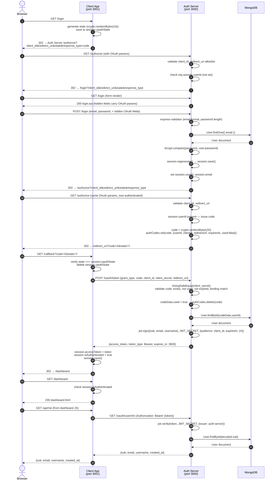
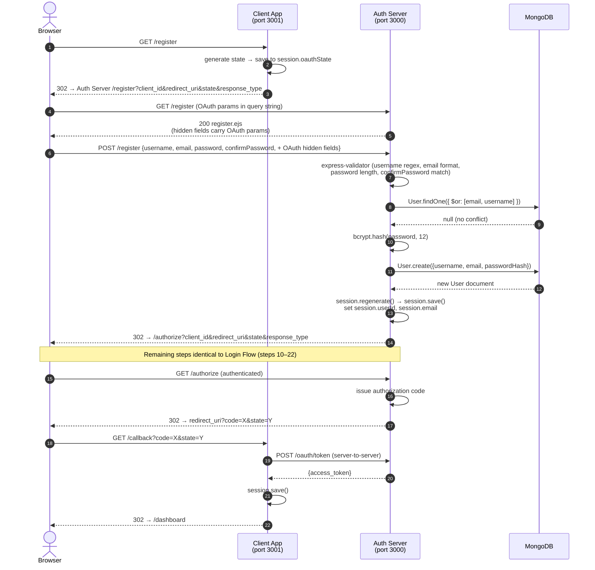
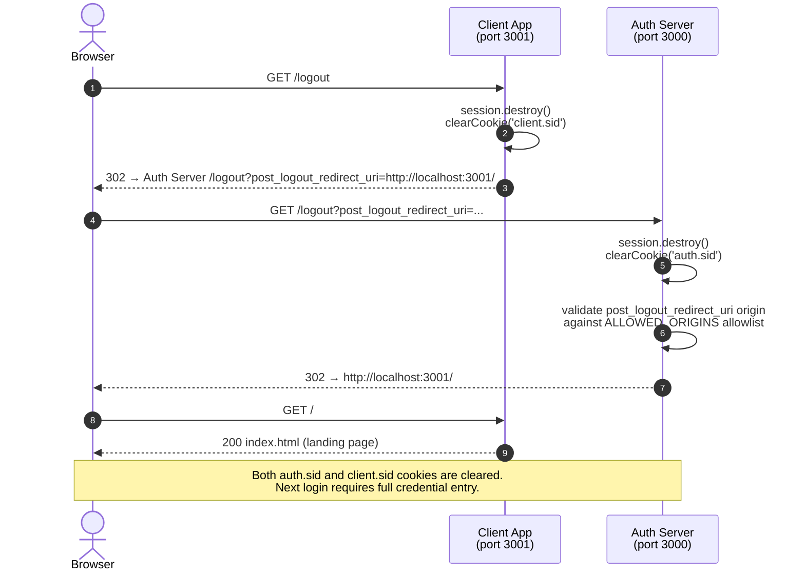
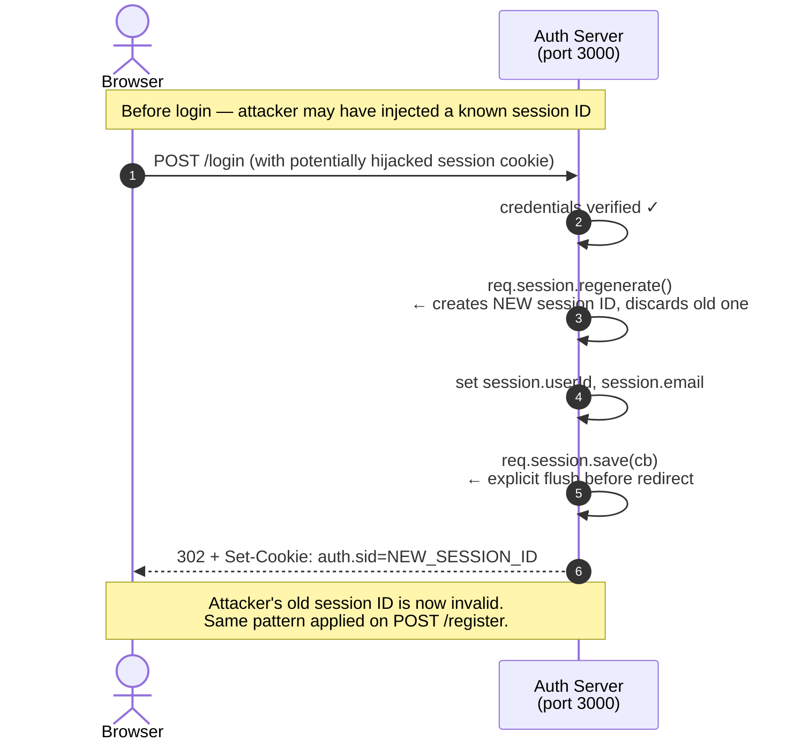
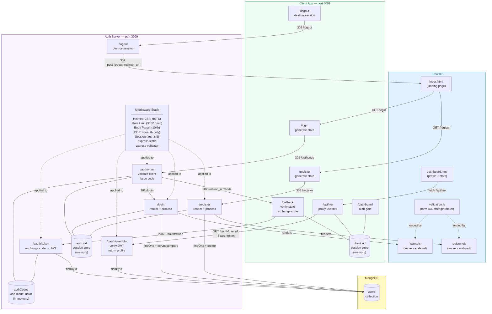

# Auth Service — System Architecture Report

> Stack: Node.js 18+ · Express 4 · MongoDB / Mongoose · JWT (HS256) · OAuth 2.0 Authorization Code Grant

---

## Table of Contents

1. [System Overview](#1-system-overview)
2. [Service Topology](#2-service-topology)
3. [Database Schema](#3-database-schema)
4. [API Surface](#4-api-surface)
5. [Security Decisions](#5-security-decisions)
6. [Session & Cookie Strategy](#6-session--cookie-strategy)
7. [Frontend Architecture](#7-frontend-architecture)
8. [Dependency Inventory](#8-dependency-inventory)
9. [Test Coverage](#9-test-coverage)
10. [Sequence Diagrams](#10-sequence-diagrams)
11. [Component Diagram](#11-component-diagram)

---

## 1. System Overview

The system implements a **two-service OAuth 2.0 Authorization Code Grant** architecture:

| Service | Port | Role |
|---------|------|------|
| **Auth Server** | 3000 | Identity Provider (IdP) — owns all user credentials, sessions, and token issuance |
| **Client App** | 3001 | Backend-for-Frontend (BFF) — acts as a confidential OAuth client on behalf of the browser |

The browser **never** receives a raw JWT or a `client_secret`. Both secrets live exclusively in server-side memory/session stores.

---

## 2. Service Topology

```
Browser
  │
  ├─── HTTP ───▶  Client App (port 3001)
  │                    │
  │                    │  server-to-server (fetch / HTTP)
  │                    ▼
  │              Auth Server (port 3000)
  │                    │
  │                    ▼
  │               MongoDB
  │
  └─── Redirect ──▶ Auth Server (browser-facing login/register forms)
```

### File Layout

```
authService/
├── auth-server/                  # Identity Provider
│   ├── server.js                 # Entry point: env validation + MongoDB boot
│   ├── app.js                    # Express factory: middleware stack, routes
│   ├── controllers/
│   │   └── authController.js     # All OAuth + auth business logic
│   ├── models/
│   │   └── User.js               # Mongoose schema
│   ├── routes/
│   │   └── authRoutes.js         # Route table + express-validator chains
│   ├── views/
│   │   ├── login.ejs             # Server-rendered login form
│   │   └── register.ejs          # Server-rendered registration form
│   ├── public/
│   │   └── js/validation.js      # CSP-safe client-side form validation
│   └── tests/
│       ├── helpers.js
│       ├── login.test.js
│       ├── oauth.test.js
│       └── registration.test.js
│
└── client-app/                   # Confidential OAuth Client (BFF)
    ├── server.js                 # All routes: /login /register /callback /api/me /dashboard /logout
    └── public/
        ├── index.html            # Landing page (Sign In / Create Account)
        ├── dashboard.html        # Protected profile page
        └── style.css             # CSS variables + utility classes
```

---

## 3. Database Schema

### Users Collection (`User.js` — Mongoose)

```
┌──────────────────────────────────────────────────────────────────┐
│  Collection: users                                               │
├────────────────┬──────────────┬─────────────────────────────────┤
│  Field         │  Type        │  Constraints                    │
├────────────────┼──────────────┼─────────────────────────────────┤
│  _id           │  ObjectId    │  Auto-generated primary key      │
│  username      │  String      │  required, unique, trim          │
│                │              │  min: 3, max: 30 chars           │
│                │              │  /^[a-zA-Z0-9_]+$/              │
│  email         │  String      │  required, unique, trim          │
│                │              │  lowercase: true                 │
│  password      │  String      │  required                        │
│                │              │  min: 60 chars (bcrypt only)     │
│  createdAt     │  Date        │  auto (timestamps: true)         │
│  updatedAt     │  Date        │  auto (timestamps: true)         │
└────────────────┴──────────────┴─────────────────────────────────┘
```

**Schema decisions:**
- `minlength: 60` on `password` enforces that only bcrypt hashes (always ≥60 chars) can be persisted — plaintext is physically rejected at the DB layer.
- `lowercase: true` on `email` normalises storage; the controller also calls `.toLowerCase()` explicitly before lookup to handle any library divergence.
- `toJSON()` is overridden to strip `password` from all JSON serialisation — the hash can never leak via `res.json(user)`.
- Unique indexes on `username` and `email` are enforced at MongoDB level; the controller handles `err.code === 11000` for the TOCTOU race window between `findOne` and `create`.

---

## 4. API Surface

### Auth Server (port 3000)

| Method | Path | Auth required | Description |
|--------|------|--------------|-------------|
| `GET` | `/` | No | Status page — shows current session state |
| `GET` | `/login` | No | Render login form |
| `POST` | `/login` | No | Validate credentials, issue session, redirect |
| `GET` | `/register` | No | Render registration form |
| `POST` | `/register` | No | Create user, issue session, redirect |
| `GET` | `/logout` | No | Destroy session, support post-logout redirect |
| `GET` | `/authorize` | Session | OAuth entry point — validate client, issue code |
| `POST` | `/oauth/token` | Client secret | Exchange authorization code for JWT |
| `GET` | `/oauth/userinfo` | Bearer JWT | Return user profile |

### Client App (port 3001)

| Method | Path | Auth required | Description |
|--------|------|--------------|-------------|
| `GET` | `/` | No | Landing page |
| `GET` | `/login` | No | Generate state, redirect to Auth Server `/authorize` |
| `GET` | `/register` | No | Generate state, redirect to Auth Server `/register` |
| `GET` | `/callback` | State token | Verify state, exchange code, save JWT in session |
| `GET` | `/api/me` | Session cookie | Proxy to `/oauth/userinfo`, return profile JSON |
| `GET` | `/dashboard` | Session cookie | Serve `dashboard.html` or redirect to `/` |
| `GET` | `/logout` | No | Destroy client session, chain to Auth Server logout |

---

## 5. Security Decisions

### 5.1 Password Storage

| Decision | Detail |
|----------|--------|
| Algorithm | bcryptjs with **12 rounds** |
| Storage | Only hash stored; `minlength: 60` DB constraint prevents plaintext |
| Verification | `bcrypt.compare()` — timing-safe by design |
| Serialisation guard | `toJSON()` deletes `password` field before any JSON response |

### 5.2 Input Validation (Defense in Depth)

Validation is applied at **three layers**:

```
Browser (validation.js)
    ↓  First line: immediate UX feedback, no round-trip
Server (express-validator in authRoutes.js)
    ↓  Second line: enforced regardless of browser state
Database (Mongoose schema constraints)
    ↓  Third line: physical last resort
```

| Field | Rules |
|-------|-------|
| `username` | 3–30 chars, `/^[a-zA-Z0-9_]+$/` |
| `email` | RFC-compliant format, stored lowercase |
| `password` | Minimum 8 characters |
| `confirmPassword` | Custom validator — must equal `password` |

`normalizeEmail()` is intentionally **omitted** — it applies aggressive transforms (Gmail dot-removal, subaddress stripping) that cause lookup mismatches between registration and login.

### 5.3 OAuth Security

| Threat | Mitigation |
|--------|-----------|
| Open Redirect | `redirect_uri` validated against a strict per-client allowlist before any code is issued |
| CSRF on callback | 16-byte cryptographically random `state` generated per flow, stored in server-side session, verified on `/callback` |
| Auth code replay | Codes are single-use; `used` flag set before async DB call; code deleted immediately after successful exchange |
| Code theft | 10-minute expiry; 256-bit entropy (`crypto.randomBytes(32)`) |
| Client impersonation | `client_secret` compared with `crypto.timingSafeEqual` — prevents timing oracle attacks |
| client_secret exposure | Exchange happens server-to-server only; secret never reaches the browser |
| Session fixation | `req.session.regenerate()` on every privilege escalation (login, register) |
| JWT scope creep | `audience` claim set to `client_id` at issuance; tokens are scoped per client |

### 5.4 HTTP Security Headers (Helmet)

| Header | Value |
|--------|-------|
| Content-Security-Policy | `default-src 'self'`; scripts from `'self'` + Tailwind CDN; no inline scripts |
| HSTS | Enabled in production (31536000s + includeSubDomains) |
| X-Frame-Options | `SAMEORIGIN` (via Helmet default) |
| X-Content-Type-Options | `nosniff` |
| Referrer-Policy | `no-referrer` |
| form-action | Removed (`null`) — avoids Chrome blocking form submissions across localhost ports |
| upgrade-insecure-requests | Only active in `NODE_ENV=production` |

### 5.5 Rate Limiting

| Environment | Window | Max requests |
|-------------|--------|-------------|
| Production / Dev | 15 minutes | 300 |
| Test (`NODE_ENV=test`) | 15 minutes | 10,000 |

Applied globally to all endpoints on the Auth Server.

### 5.6 Body Size Limits

```
express.json({ limit: '10kb' })
express.urlencoded({ extended: true, limit: '10kb' })
```

Prevents DoS via oversized payloads. Applied before all route handlers.

### 5.7 CORS

Scoped exclusively to `/oauth/*` endpoints. Only origins in `ALLOWED_ORIGINS` (env var, comma-separated) are permitted. Credentials not allowed on these cross-origin requests (tokens are exchanged server-to-server, not from the browser).

### 5.8 XSS Mitigation

- All user-controlled strings rendered in EJS views are escaped via EJS's default `<%= %>` (HTML-entity encoding).
- The one `res.send()` call (home page) manually escapes `req.session.email` with `.replace()` chains before interpolation.
- CSP `script-src 'self'` blocks all inline scripts; all client JS lives in the static-served `public/js/validation.js`.

---

## 6. Session & Cookie Strategy

### Auth Server Session (`auth.sid`)

```
Name:              auth.sid
Secret:            SESSION_SECRET env var (≥64 random bytes)
httpOnly:          true
secure:            true in production, false in development
sameSite:          lax
maxAge:            24 hours (rolling)
saveUninitialized: false
resave:            false
rolling:           true  (extends expiry on each request)
```

**Key fields stored:**
- `userId` — MongoDB ObjectId as string
- `email` — used for display only (escaped before output)

### Client App Session (`client.sid`)

```
Name:              client.sid
Secret:            SESSION_SECRET env var
httpOnly:          true
secure:            true in production
sameSite:          lax
maxAge:            1 hour (matches JWT expiry)
saveUninitialized: false
resave:            false
```

**Key fields stored:**
- `oauthState` — one-time CSRF token (deleted immediately after use)
- `accessToken` — the JWT (never sent to browser)
- `isAuthenticated` — boolean flag checked on protected routes

**Why two distinct cookie names?** HTTP cookies are port-agnostic on `localhost`. Without distinct names, the auth server and client app would overwrite each other's `connect.sid` cookie, causing session loss.

**Why explicit `session.save()` before redirect?**  
`session.regenerate()` and post-assignment state do not auto-flush. With `saveUninitialized: false`, the session write is not guaranteed before the browser follows a redirect. Both services call `req.session.save(cb)` before every `res.redirect()` after session mutation.

---

## 7. Frontend Architecture

### Client-side Validation (`public/js/validation.js`)

All client JS is CSP-compliant — no inline `<script>` blocks, no `onclick=""` attributes.

| Feature | Implementation |
|---------|---------------|
| Field validation on blur | `wireField()` registers `blur` + `input` listeners |
| Submit button gating | `registeredFields[]` array; `updateBtn()` polls all fields silently |
| Password strength meter | 4-segment bar: Weak / Fair / Good / Strong (score 0–4) |
| Password show/hide | `data-pw-toggle` attribute; `addEventListener('click')` |
| Server error pre-population | EJS conditionally applies `field-error` CSS class server-side via `errorField` template variable |
| Confirm password sync | `confirmField.run()` re-validates whenever password field changes |

### Visual Validation States

```css
.field-valid  { border-color: #10b981; box-shadow: 0 0 0 3px rgba(16,185,129,.18); }
.field-error  { border-color: #ef4444; box-shadow: 0 0 0 3px rgba(239,68,68,.18);  }
```

Both states animate via `transition: border-color .2s, box-shadow .2s`.

### Server-side Rendering (EJS)

Forms are server-rendered with EJS. The `errorField` variable lets the controller mark a specific input as invalid on the initial page load (before any JavaScript runs), providing zero-JS accessibility and correct behaviour when JS is disabled.

---

## 8. Dependency Inventory

### Auth Server

| Package | Version | Purpose |
|---------|---------|---------|
| `express` | ^4.18.3 | HTTP framework |
| `mongoose` | ^7.6.3 | MongoDB ODM |
| `express-session` | ^1.17.3 | Server-side session management |
| `express-validator` | ^7.0.1 | Input validation and sanitisation chains |
| `bcryptjs` | ^2.4.3 | Password hashing (12 rounds) |
| `jsonwebtoken` | ^9.0.2 | JWT signing (HS256) and verification |
| `helmet` | ^7.0.0 | Security HTTP headers (CSP, HSTS, etc.) |
| `express-rate-limit` | ^7.1.5 | Request rate limiting |
| `cors` | ^2.8.5 | CORS headers for `/oauth` endpoints |
| `ejs` | ^3.1.9 | Server-side HTML templating |
| `dotenv` | ^16.3.1 | `.env` file loading |
| `jest` (dev) | ^29.5.0 | Test runner |
| `supertest` (dev) | ^6.3.3 | HTTP assertions in tests |
| `nodemon` (dev) | ^3.0.3 | Dev-mode auto-restart |

### Client App

| Package | Version | Purpose |
|---------|---------|---------|
| `express` | ^4.18.3 | HTTP framework (BFF server) |
| `express-session` | ^1.17.3 | Server-side session (stores JWT) |
| `dotenv` | ^16.3.1 | `.env` file loading |
| `nodemon` (dev) | ^3.0.3 | Dev-mode auto-restart |

Node.js ≥ 18.0.0 required (native `fetch` API used for server-to-server calls).

---

## 9. Test Coverage

38 tests across 3 suites. All run with `jest --runInBand --forceExit` against an isolated `auth-server-test` MongoDB database.

### login.test.js (10 tests)

| Test | What it verifies |
|------|-----------------|
| Valid credentials → redirect to `/` | Happy path without OAuth params |
| Session cookie set after login | `auth.sid` present in response |
| Valid credentials + OAuth params → redirect to `/authorize` | Full OAuth flow redirection |
| Session persists into `/authorize` | `session.save()` race condition fix |
| Failed login does not bleed to next GET | Error state isolation |
| Multiple failed attempts isolated | No cross-request error leakage |
| Unknown email → register hint | `registerHint` flag, `errorField: 'email'` |
| Wrong password → error on password field | `errorField: 'password'` |
| Invalid email format → 200 with validation error | express-validator |
| Password under 8 chars → validation error | express-validator |

### registration.test.js (11 tests)

| Test | What it verifies |
|------|-----------------|
| New user saved to DB | Full document creation |
| Password stored as bcrypt hash | `/^\$2[ab]\$12\$/` match |
| No OAuth params → redirect to `/login` | Post-registration redirect |
| With OAuth params → redirect to `/authorize` | OAuth flow continuation |
| Session cookie set after registration | `auth.sid` present |
| Session persists into `/authorize` | `session.save()` fix |
| Duplicate email → 200 with error | Duplicate detection |
| Duplicate username → 200 with error | Duplicate detection |
| Password < 8 chars → validation error | express-validator |
| Mismatched passwords → validation error | Custom validator |
| Invalid username chars → validation error | Regex validator |

### oauth.test.js (17 tests)

| Test | What it verifies |
|------|-----------------|
| Unauthenticated → redirect to `/login` | Auth gate |
| All OAuth params preserved in redirect | Query string passthrough |
| Authenticated → code issued, state echoed | Happy path authorize |
| State echoed unchanged | CSRF token passthrough |
| Missing `state` → 400 | Required param guard |
| Unknown `client_id` → 400 | Client registry check |
| Unregistered `redirect_uri` → 400 | Open Redirect guard |
| Valid code → `access_token` + `token_type` + `expires_in` | Token exchange |
| JWT has correct claims (`sub`, `email`, `username`) | Payload verification |
| Reused code → 400 `invalid_grant` | Replay attack prevention |
| Wrong `client_secret` → 401 | Client authentication |
| `redirect_uri` mismatch → 400 | Code binding check |
| Invalid/fake code → 400 | Code lookup failure |
| Valid Bearer token → user profile | Userinfo endpoint |
| Missing Authorization header → 401 | Header guard |
| Tampered JWT → 401 | Signature verification |
| End-to-end: register → authorize → token → userinfo | Full integration |

---

## 10. Sequence Diagrams

### 10.1 Login Flow (OAuth Authorization Code Grant)



---

### 10.2 Registration Flow



---

### 10.3 Logout Flow



---

### 10.4 Session Fixation Mitigation



---

## 11. Component Diagram



---

## Summary of All Handled Concerns

| Category | Handled |
|----------|---------|
| **Auth flow** | OAuth 2.0 Authorization Code Grant (RFC 6749) |
| **Registration** | Username + email + password, bcrypt 12 rounds, session issuance |
| **Login** | Email lookup, bcrypt compare, session fixation mitigation |
| **Token issuance** | Single-use codes (256-bit), 10-min expiry, JWT HS256 with audience |
| **Token verification** | Issuer + expiry checked; user existence re-verified from DB |
| **Logout** | Both sessions destroyed; cookies cleared; chained logout |
| **CSRF** | Cryptographic `state` per OAuth flow |
| **Open Redirect** | `redirect_uri` and `post_logout_redirect_uri` allowlist validation |
| **Code replay** | `used` flag + immediate deletion |
| **Timing attacks** | `crypto.timingSafeEqual` for `client_secret` comparison |
| **Session race condition** | Explicit `session.save()` before every redirect after mutation |
| **Cookie collision** | Distinct names: `auth.sid` vs `client.sid` |
| **XSS** | CSP `script-src 'self'`, EJS auto-escaping, manual escaping in `res.send()` |
| **DoS** | Rate limiting (300/15min), body size limit (10kb) |
| **DB race condition** | `err.code === 11000` handler for duplicate-key on concurrent registration |
| **secret exposure** | `client_secret` and JWT never sent to browser; stored server-side only |
| **Input validation** | Three-layer: client JS → express-validator → Mongoose schema |
| **Test coverage** | 38 tests across login, registration, and full OAuth flows |
